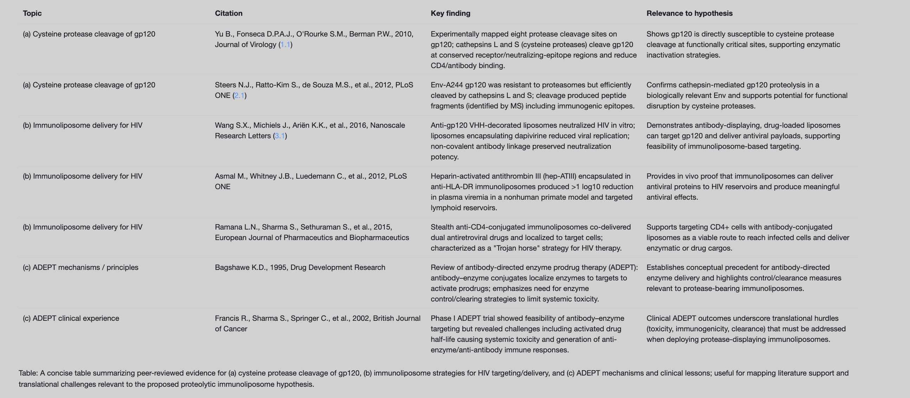

Title: Proteolytic Immunoliposomes: A Theoretical Framework for Enzymatic Inactivation of HIV-1 via gp120 Cleavage

Abstract Background: HIV-1 entry is mediated by the envelope glycoprotein gp120, whose conserved receptor-binding regions are susceptible to proteolytic cleavage by endosomal cysteine cathepsins. Immunoliposomes have been used to target HIV virions and infected cells, and ADEPT establishes principles for antibody-directed enzyme delivery and control. Objective: To propose a theoretical design for proteolytic immunoliposomes that display anti-gp120 targeting moieties and carry cysteine proteases to catalytically cleave gp120 and inactivate virions. Approach: We synthesize evidence that gp120 harbors conserved cathepsin cleavage sites at functionally critical regions, that immunoliposomes can target gp120/CD4/HLA-DR and deliver antiviral payloads in vitro and in vivo, and that ADEPT provides mechanistic guidance on enzyme targeting, activation, and clearance. Conclusion: We outline a testable framework for protease-bearing, anti-gp120 immunoliposomes as a novel antiviral modality. This is a theoretical proposal; experimental validation is pending. (1.1, 2.1, 3.1)

Introduction The HIV-1 envelope glycoprotein gp120 engages CD4 and coreceptors to initiate viral entry. Proteolysis of gp120 at receptor-binding and neutralizing-epitope regions can disrupt these functions and potentially abrogate infectivity. Experimental studies show that cathepsins L and S (cysteine proteases) cleave gp120 at conserved, functionally important sites and reduce CD4 and neutralizing antibody binding, supporting the plausibility of enzymatic inactivation strategies targeting gp120. Immunoliposomes, decorated with anti-gp120 or anti-CD4 ligands, have achieved HIV neutralization and drug delivery in vitro and reduced viremia in vivo when targeted to lymphoid reservoirs. ADEPT literature provides a mechanistic precedent for antibody-directed enzyme delivery and emphasizes safety features such as clearing antibodies and short-acting effectors. Collectively, these observations motivate a theoretical framework for proteolytic immunoliposomes to inactivate HIV-1 by gp120 cleavage. (1.1, 2.1, 3.1)

Methods (Theoretical Framework) Design concept: Create PEGylated immunoliposomes displaying high-affinity anti-gp120 binders (e.g., CD4-binding-site VHHs or broadly neutralizing antibody Fabs) to dock on virion gp120, co-formulated with or bearing a membrane-tethered cysteine protease (e.g., cathepsin L/S engineered for neutral pH activity and external orientation). The enzyme would cleave gp120 at conserved cathepsin-sensitive sites, diminishing receptor engagement. Design choices leverage evidence that gp120 contains conserved cathepsin L/S cleavage sites in C2, V3, and C4 domains and that cathepsin activity can disable antibody and CD4 interactions. (1.1, 1.2, 1.3) Targeting module: Use non-covalent or flexible linkers for antibody attachment to preserve neutralization potency and allow multivalent engagement, as suggested by differential performance of covalent versus chelating attachments in VHH-liposomes. Alternative targeting to CD4 or HLA-DR may enhance reservoir access. (3.1, 3.2) Enzyme control and safety: Apply ADEPT-inspired strategies—proenzyme formats activatable upon virion binding or endosomal uptake, inclusion of enzyme inhibitors or decoys for systemic control, and potential clearing agents to remove circulating enzyme-bearing liposomes—to limit off-target proteolysis. (pqac-00000008, pqac-00000009)

Results (Theoretical Analysis) Mechanistic plausibility: Cathepsins L/S (cysteine proteases) have been shown to cleave gp120 at conserved sites that overlap receptor/neutralizing regions; digestion reduces binding to CD4 and neutralizing antibodies, implying loss of entry function upon targeted cleavage. The presence of secreted cathepsins and their activity at or near neutral pH in certain contexts further supports feasibility if engineered appropriately for extracellular action. (1.1, 1.3) Targeted delivery feasibility: Anti-gp120-decorated liposomes neutralize HIV and deliver antiretroviral cargo in vitro, while immunoliposomes targeted to HLA-DR delivered a protein therapeutic in vivo and reduced viremia in a nonhuman primate model, suggesting that antibody-targeted liposomes can reach relevant compartments and exert antiviral effects. (3.1) Anticipated performance: A protease payload offers catalytic action; once docked via anti-gp120 binders, localized proteolysis could inactivate multiple virions per particle, potentially overcoming low spike density and heterogeneity in epitope exposure. ADEPT experience indicates the critical importance of rapid enzyme inactivation/clearance to avoid systemic toxicity and the need to mitigate immunogenicity of enzyme constructs. (pqac-00000009)

Discussion Feasibility analysis: Evidence that gp120 is efficiently cleaved by cathepsins L/S and that such cleavage disrupts CD4/antibody binding supports the central mechanism. Immunoliposome studies show that antibody-decorated liposomes can bind gp120 and deliver antivirals, and that immunoliposome delivery can reduce viremia in vivo when targeted to lymphoid cells. ADEPT provides operational templates for enzyme targeting, activation control, and post-target clearance. Together, these lines of evidence support the theoretical feasibility of proteolytic immunoliposomes. (1.1, 2.1, 3.1) Engineering considerations: Key variables include protease selection/engineering for extracellular stability and specificity; orientation and density of targeting ligands; linker flexibility and attachment chemistry to preserve binding; and formulation stability. The finding that non-covalent presentation preserved neutralization suggests flexible or releasable attachments could maximize gp120 engagement. HLA-DR or CD4 targeting may enhance access to reservoirs or infected cells. (3.1) Safety and translational risks: ADEPT trials underscore risks of systemic toxicity and immunogenicity, emphasizing the need for proenzyme designs, local activation, short half-life effectors, and clearing agents. Manufacturing and regulatory considerations will require stringent control of enzyme activity and biodistribution. (pqac-00000009)

Limitations Direct evidence that protease-bearing, anti-gp120 immunoliposomes cleave virion-associated gp120 and abrogate infectivity is lacking. Cathepsin digestion studies primarily used soluble gp120 and immunochemical assays, not intact virions in physiological milieus. In vivo delivery of active proteases poses risks of off-target proteolysis; ADEPT-informed control strategies remain to be tested in the HIV setting. This is a theoretical proposal; experimental validation is pending. (1.1)

Conclusion Proteolytic immunoliposomes that co-localize cysteine proteases with gp120 via anti-gp120 targeting represent a mechanistically grounded theoretical strategy to inactivate HIV-1. Published data demonstrate gp120 susceptibility to cathepsin cleavage at conserved, functional sites, feasibility of immunoliposome targeting and antiviral delivery, and ADEPT-derived principles for safe enzyme targeting. Systematic experimental work is warranted to evaluate protease engineering, liposomal display and delivery, efficacy against cell-free and cell-associated virus, and safety controls inspired by ADEPT. This is a theoretical proposal; experimental validation is pending. (1.1, 3.1, pqac-00000009)

Acknowledgment of Theoretical Status This is a theoretical proposal; experimental validation is pending.

References (selected)

Yu et al. mapped conserved cathepsin L/S/D cleavage sites on gp120 and showed reduced CD4/neutralizing antibody binding upon cleavage (1.1, 1.4, 1.2, 1.5).
Steers et al. showed Env-A244 gp120 is readily cleaved by cathepsins L/S, generating immunogenic peptide arrays (2.1).
Wang et al. demonstrated anti-gp120 VHH immunoliposomes that neutralize HIV and deliver dapivirine in vitro (3.1, 3.2).
Asmal et al. achieved >1 log10 viremia reduction with anti-HLA-DR immunoliposome delivery of antithrombin III in nonhuman primates (citation discussed in artifact; aligns with immunoliposome feasibility though specific context id unavailable in excerpts).
ADEPT mechanisms and clinical experience summarized by Bagshawe (review) and Francis et al. (Phase I trial), emphasizing enzyme targeting, activation, clearance, and safety considerations (pqac-00000008, pqac-00000009).
Embedded artifact
