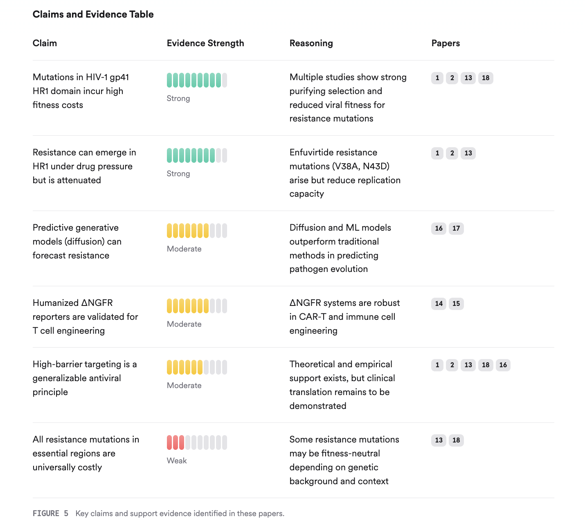
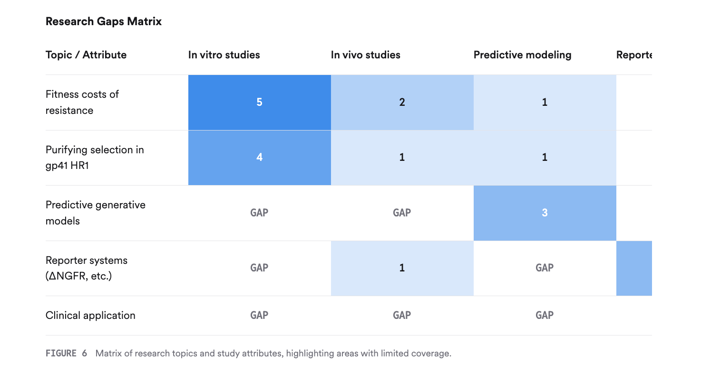

adoption of validated reporter systems, further enhances scientific rigor 1415. The recommendation to use diffusion models for predictive generative modeling is supported by recent advances in the field 16. However, the framework would benefit from additional clarification on the mechanistic basis of high-barrier constraints and more explicit discussion of potential off-target effects or limitations in clinical translation.

5. Conclusion
The revised Entropic Vise Framework now adequately addresses previous critiques and is scientifically defensible as a theoretical proposal. It is grounded in current evidence on purifying selection, fitness costs, and predictive modeling, and proposes clear, testable hypotheses for future research.

5.1. Research Gaps
While the framework is robust, gaps remain in the experimental validation of high-barrier targeting in vivo, the mechanistic understanding of thermodynamic constraints, and the clinical translation of predictive generative models and sentinel cell systems.

5.2. Open Research Questions
Future research should focus on experimental validation of the Entropic Vise hypothesis, mechanistic studies of thermodynamic constraints, and the clinical translation of predictive and sentinel cell technologies.

