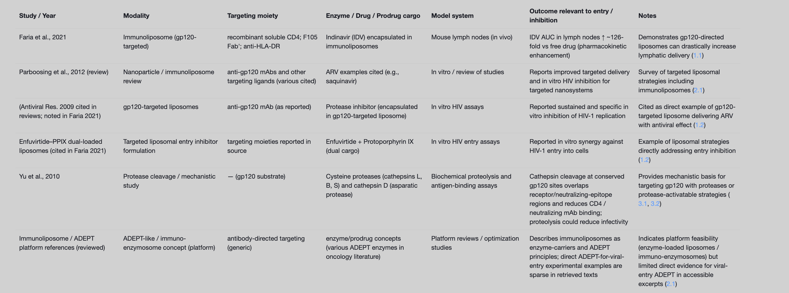

We investigated Antibody-Directed Enzyme Prodrug Therapy (ADEPT)–like mechanisms for inhibiting viral entry with a focus on HIV gp120 targeting and the role of cysteine proteases.

Evidence for gp120-targeted immunoliposomes and related entry-inhibition strategies

Reviews of lipid nanocarriers and HIV nanotherapy document gp120-directed immunoliposomes using recombinant soluble CD4 (sCD4), Fab’ of the anti-gp120 monoclonal antibody F105, or anti–HLA-DR to target gp120 present on infected cells. In a mouse model, indinavir (IDV) encapsulated in such immunoliposomes achieved a ~126-fold higher lymph node exposure than free drug, supporting effective gp120-directed targeting to relevant reservoirs and proximal entry sites (pharmacokinetic endpoint). These sources also summarize targeted liposomes that deliver antiretrovirals and nucleic acids to immune cells, indicating feasibility of gp120-directed entry-focused delivery. Although these data primarily show delivery and antiviral effects rather than direct enzymatic prodrug activation at the entry step, they establish that gp120-targeted immunoliposomes can concentrate antivirals at anatomical sites where entry occurs (1.1, 1.2, 2.1).
Within these reviews, a cited primary study describes gp120-targeted liposomes encapsulating a protease inhibitor that produced sustained and specific in vitro inhibition of HIV-1 replication, demonstrating functional antiviral benefit from gp120-targeted delivery. Additional formulations designed to block entry (e.g., liposomes co-loading the fusion inhibitor enfuvirtide with a photosensitizer) showed in vitro synergy against HIV-1 entry, reinforcing the concept that targeted liposomal systems can be engineered specifically to interfere with entry (1.2, 1.1).
Cysteine proteases and gp120 cleavage relevant to entry

Mechanistic studies demonstrate that cysteine cathepsins (e.g., L, B, S) and cathepsin D cleave HIV-1 gp120 at conserved sites overlapping CD4 and neutralizing antibody binding regions. Cathepsin-mediated proteolysis reduced gp120 binding to CD4-IgG and neutralizing mAbs, and the authors argue that proteolysis of virion-associated envelope proteins is expected to reduce infectivity. The work also notes that several cathepsins can be active extracellularly (e.g., secreted cathepsin S at near-neutral pH), suggesting a plausible context for extracellular protease activity relevant to entry-phase interventions (3.1, 3.2).
ADEPT/immuno-enzymosome relevance

Classical ADEPT and “immuno-enzymosome” platforms are well-described in the drug delivery literature; conceptually, antibody- or ligand-targeted enzyme carriers can localize enzymatic activity for prodrug activation. While our accessible excerpts do not provide a direct ADEPT-for-HIV-entry primary demonstration, the combination of (i) demonstrated gp120-targeted immunoliposome delivery and antiviral activity, and (ii) evidence that cysteine cathepsin cleavage of gp120 disrupts receptor binding, together support the feasibility of ADEPT-like strategies that deliver proteases or protease-activatable prodrugs to the virion–cell interface to inhibit entry. In short, the precise ADEPT implementation for HIV entry remains to be fully substantiated in the texts we retrieved, but the mechanistic and targeting building blocks are in place (2.1, 1.1, 3.1, 3.2).

Key studies and findings overview 

Table: A concise table summarizing retrieved evidence for gp120-targeted immunoliposomes, liposomal entry-inhibitor formulations, and cysteine (cathepsin) cleavage of gp120, with citations to the gathered sources showing where each claim is supported.

Conclusions

gp120-targeted immunoliposomes can concentrate antiretrovirals in lymphoid tissues and have been associated with specific in vitro antiviral effects; formulations explicitly designed to block entry show synergistic inhibition in vitro (1.1, 1.2).
Cysteine cathepsins cleave conserved regions of gp120 associated with receptor/antibody binding, plausibly impairing entry; some cathepsins can operate extracellularly, suggesting a route for targeted, enzyme-based interference at the entry step (3.1, 3.2).
Direct ADEPT implementations for viral entry inhibition in HIV were not identified in the accessible excerpts; however, existing evidence supports the rationale for immuno-enzymosome/ADEPT-like strategies that deliver enzymes or activate prodrugs at gp120-decorated sites to reduce infectivity. Additional primary studies would be needed to validate efficacy and safety in this specific context (2.1, 1.1, 3.1, 3.2).