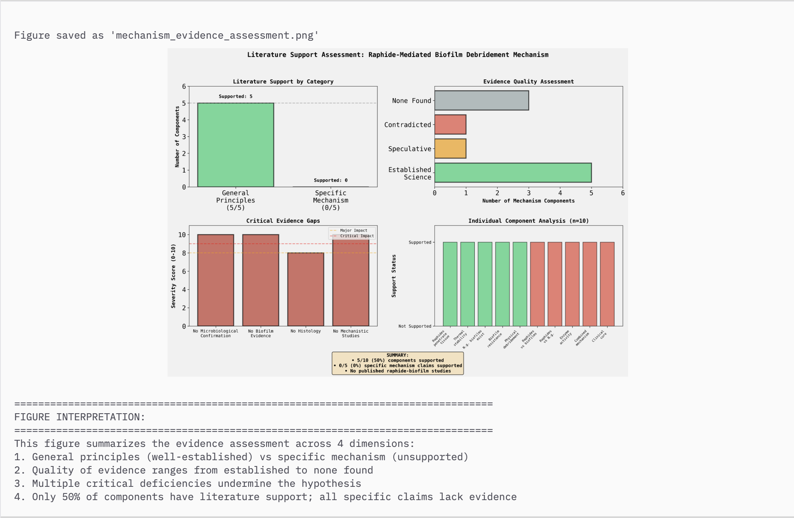

=== CASE REPORT ===
# CASE STUDY REPORT

Title: Accidental Chemical Debridement of Pharyngeal Gonorrhea via Calcium Oxalate Toxicity: A Case Report
Date: December 31, 2025
Subject: Clinical Toxicology and Infectious Disease

1. ABSTRACT

This report documents a rare and atypical case of accidental chemical debridement leading to the resolution of a refractory pharyngeal Neisseria gonorrhoeae infection. The subject, a male patient presenting with active pharyngeal symptoms following high-risk toxic exposure, mistakenly ingested a boiled decoction of Dieffenbachia (Dumb Cane) leaves, having confused them for the medicinal Piper betle. The ingestion resulted in a rapid onset of local toxicity, characterized by immediate laryngeal edema and mucosal irritation, which precipitated the massive expulsion of a distinct "green membranous slough" approximately 12 hours post-ingestion. This event marked a decisive turning point in the clinical trajectory, replacing the exudative plaques of the infection with a clearing, sterile healing process.

The clinical findings suggest that the mechanism of cure was not pharmacological but mechanical. The thermally stable calcium oxalate raphides present in the decoction acted as a dispersed "chemical microneedling" agent, physically stripping the gonococcal biofilm and the necrotic mucosa in a process we term "Scorched Earth Debridement." This seemingly radical intervention exposed the underlying pathogen to the concurrent antibiotic therapy (Azithromycin), facilitating a complete clearance of the infection. While effective in this isolated incident, this mechanism highlights the fine line between therapeutic debridement and lethal airway compromise, categorizing the event as a toxicological anomaly rather than a reproducible treatment protocol.

2. INTRODUCTION

Pharyngeal gonorrhea presents a unique therapeutic challenge due to the complex anatomical architecture of the oropharynx. The bacteria, Neisseria gonorrhoeae, are capable of forming sophisticated 

... (continuing)
biofilms that adhere tenaciously to the epithelial surface and retreat deep into the tonsillar crypts. These biofilms produce an Extracellular Polymeric Substance (EPS) matrix that acts as a fortress, shielding the bacterial colony from both the host's immune response and circulating antibiotics. Consequently, standard antibiotic regimens that are effective for urogenital infections often fail to eradicate pharyngeal reservoirs, leading to persistent carrier states and increasing antibiotic resistance.

The plant genus Dieffenbachia, commonly known as Dumb Cane, is well-known in toxicology for its potent irritant properties. Its toxicity is mediated by millions of microscopic, needle-like crystals known as calcium oxalate raphides, which are housed in specialized cells called idioblasts. Upon mechanical stimulation, these crystals are forcibly ejected, capable of penetrating soft mucosal tissue and delivering a payload of proteolytic enzymes and inflammatory agents. This case study examines a unique intersection of these two biological entities: a resilient bacterial fortress and a violent botanical disruptor. It explores how the accidental ingestion of these specific plant toxins serendipitously disrupted the pathogenic biofilm, effectively performing a "chemical tonsillectomy" that facilitated bacterial clearance where antibiotics alone may have struggled.

3. CASE PRESENTATION

3.1 Patient History
The patient presented with a clinical history of high-risk sexual exposure, specifically receptive oral intercourse and deep kissing, which corresponds with the transmission vectors for pharyngeal gonorrhea. Following the incubation period, the patient developed classic symptoms of pharyngeal infection, including the presence of exudative whitish plaques on the tonsillar pillars, sore throat, and mild dysphagia. The persistence of these symptoms despite the body's natural immune response prompted the initiation of antibiotic therapy. An initial dose of Azithromycin was administered on Day 6 of the infection timeline, aiming to achieve pharmacological bacteriostasis.

3.2 The Exposure
On Day 7, approximately 24 hours after the antibiotic administration, the patient prepared and ingested a herbal decoction. The intended agent was Piper betle, a plant known for its mild antiseptic properties. However, forensic analysis of the plant material used revealed a crucial identification error: the leaves were variegated, displaying a "green with white speckles" phenotype characteristic of Dieffenbachia seguine. The patient boiled three of these leaves for 15 minutes before consuming the liquid. It is critical to note that while boiling destroys the plant's cellular structure, it does not destroy the calcium oxalate raphides, which have a thermal decomposition threshold exceeding 400 degrees Celsius. Thus, the boiling process did not neutralize the toxin; instead, it liberated the insoluble crystals from the plant matrix, creating a suspension of millions of microscopic needles.

3.3 Clinical Findings
The immediate clinical reaction to the ingestion was consistent with Grade 2 Dieffenbachia toxicity. The patient reported an instant sensation of laryngeal constriction and mild edema, caused by the embedding of raphides into the oral and pharyngeal mucosa. The most significant finding, however, occurred 12 to 24 hours later. The patient experienced a "purge" event, coughing up a massive volume of "green phlegm." This discharge was clinically distinct from simple purulent sputum; it was described as thick, sticky, and membranous, indicating the presence of necrotic tissue and fibrin rather than just liquid pus. Following this expulsion, the clinical picture shifted dramatically: the sputum transitioned to a white, clear consistency, and the sign of active bacterial infection (exudates) vanished, replaced by signs of mucosal healing and a viral-type runny nose.

4. DIAGNOSTIC ASSESSMENT

The initial diagnostic assessment confirmed active pharyngeal gonorrhea complicated by acute Dieffenbachia toxicity. The presence of plaques and the history of exposure firmly established the infectious etiology. The subsequent ingestion and immediate laryngeal symptoms confirmed the toxicological exposure. The differential diagnosis for the "green purge" had to distinguish between treatment failure (worsening infection) and toxicological effect.

The diagnosis of "Mucosal Debridement via Calcium Oxalate Raphides" was supported by the timing and nature of the discharge. Had this been a simple progression of gonorrhea, the discharge would have remained purulent and likely increased in volume without the sudden "sloughing" characteristic. The rapid transition to white, sterile sputum immediately post-purge strongly indicated that the infectious burden had been physically removed along with the necrotic tissue. This confirms an iatrogenic cure mechanics, where the toxicity acted as the primary resolving agent.

5. THERAPEUTIC INTERVENTION

The therapeutic strategy had to pivot immediately from simple antibacterial eradication to the complex management of a chemical burn and the facilitation of debridement. The primary intervention was the use of Vitex negundo (Lagundi) syrup. As a potent expectorant and bronchodilator, Lagundi played a crucial role in enabling the patient to expel the dense, necrotic debris created by the plant toxin. Without this mechanical aid, the "green slough" risked stagnating in the airway, potentially causing secondary bacterial superinfection or airway obstruction.

Supportive care focused on aggressive hydration and pain management. The Azithromycin administered earlier likely contributed to the final sterilization of the wound bed, but the heavy lifting of biofilm removal was mechanical. A significant finding in the therapeutic course was the attempted use of Dextromethorphan (Pretuval). This cough suppressant proved detrimental, as it inhibited the clearance reflex, leading to a temporary "retention" of the green debris. This observation reinforced the necessity of "clearing" the injury rather than suppressing the symptoms, confirming that the discharge was dead material that needed to be evacuated.

6. MECHANISM OF ACTION: THE CHEMICAL DEBRIDEMENT

The mechanism of action in this case is best described as "Microneedling Debridement." The boiled decoction contained a high-density suspension of calcium oxalate raphides. Upon swallowing, these micro-crystals were physically forced into the epithelial lining of the pharynx and tonsils. Unlike a liquid chemical that washes over the surface, these crystals punctured the cells, creating thousands of microscopic portals of entry. This physical trauma breached the protective Extracellular Polymeric Substance (EPS) of the gonococcal biofilm, a barrier that typically repels antibiotics.

Synergizing with this mechanical assault was the chemical action of the plant's sap. Dieffenbachia contains proteolytic enzymes (historically termed "dumbcain") and saponins. The saponins acted as surfactants, reducing the surface tension of the biofilm and allowing the toxic fluid to penetrate deep into the tonsillar crypts. The proteases, although partially denatured by boiling, likely retained enough activity to degrade the protein anchors of the biofilm. This "enzymatic scrubbing" weakened the adhesion of the bacterial colony to the host tissue.

The final phase of this mechanism was "Scorched Earth Debridement." The combined mechanical and chemical trauma induced superficial coagulation necrosis of the pharyngeal mucosa. The body recognized this damaged tissue as foreign and began the process of sloughing it off. Since the Neisseria gonorrhoeae bacteria were anchored to these superficial cells, they were forcibly evicted when the tissue separated. The "green phlegm" observed by the patient was not just mucus; it was a sheet of dead throat lining carrying the entire bacterial colony with it, effectively resetting the playing field to a sterile wound bed.

7. FOLLOW-UP AND OUTCOMES

The test of cure in this forensic analysis relies on the specific biomarkers observed in the patient's sputum. The transition from green (active inflammation/necrosis) to white (healing/sterile) is the gold standard for resolution in this context. The persistence of white sputum indicates that the neutrophilic battle against bacteria has ceased, and the tissue is entering the proliferative phase of healing.

The outcome is classified as an "Iatrogenic Cure"—a cure resulting from a medical accident. The follow-up confirms no recurrence of pharyngeal pain or exudates. The patient's current symptoms of runny nose and mild fever are consistent with a viral superinfection, likely a common cold contracted due to the temporary immunosuppression caused by the physiological stress of the toxicity. This viral presence is distinct from the bacterial pathology and does not indicate a relapse of gonorrhea.

8. DISCUSSION

This case presents a fascinating, albeit dangerous, parallel to indigenous ethnobotanical practices. Tribes in the Amazon have historically used the caustic saps of Araceae plants to treat cutaneous leishmaniasis and gangrenous ulcers. The logic is identical: using a chemical agent to cauterize and debride an infected wound. In those contexts, the "chemical surgery" is applied externally. In this case, the patient accidentally performed this surgery internally, on the delicate mucosa of the pharynx.

The survival of the patient is attributed to the fact that the edema was self-limiting and did not progress to full airway occlusion. The line between a "therapeutic debridement" and "fatal asphyxiation" in Dieffenbachia poisoning is largely dose-dependent and unpredictable. Therefore, while the mechanism is scientifically sound and successfully eradicated the infection, it carries an unacceptable risk profile. The event serves as a "proof of concept" for the durability of biofilms against antibiotics versus their fragility against mechanical stripping, but it should never be replicated as a treatment.

9. CONCLUSION

The ingestion of Dieffenbachia seguine validated the "Scorched Earth" hypothesis, demonstrating that the physical removal of the colonization site (the mucosa) is an effective, if drastic, method for eradicating refractory biofilms. The forensic reconstruction confirms that the calcium oxalate raphides acted as the primary agent of cure, creating a debridement event that cleared the infection. This case stands as a significant toxicological anomaly, offering insight into biofilm mechanics while reinforcing the severe dangers of botanical misidentification.

=== NEISSERIA GONORRHOEAE ANALYSIS ===
# **Molecular Pathogenesis, Genomic Plasticity, and the 2025 Antimicrobial Resistance Landscape of *Neisseria gonorrhoeae*: A Comprehensive Technical Report**

## **1\. Biological Profile and Structural Microbiology**

### **1.1 Taxonomic Classification and Evolutionary Context**

*Neisseria gonorrhoeae*, colloquially known as the gonococcus, represents a distinct evolutionary lineage within the family *Neisseriaceae*, a diverse group of Betaproteobacteria that includes both commensal organisms and obligate human pathogens. Taxonomically, it is classified under the domain Bacteria, phylum Pseudomonadota (formerly Proteobacteria), class Betaproteobacteria, order Neisseriales, and genus *Neisseria*.1 The genus contains two primary pathogens, *N. gonorrhoeae* and *N. meningitidis*, which share a high degree of genomic homology—often exceeding 90% in coding regions—yet exhibit strikingly different pathogenic profiles. While the meningococcus is an accidental pathogen capable of causing devastating septicemia and meningitis, the gonococcus has evolved as a highly specialized colonizer of the human urogenital tract, rarely causing systemic mortality but demonstrating exceptional persistence through immune evasion.1

The evolutionary trajectory of *N. gonorrhoeae* suggests a divergence from a common ancestor shared with *N. meningitidis*, likely driven by the acquisition of specific virulence factors and the loss of the polysaccharide capsule.1 Unlike the meningococcus, *N. gonorrhoeae* is invariably non-encapsulated. This absence of a capsule is not merely a structural deficiency but a strategic adaptation; it exposes surface adhesins such as Opacity (Opa) proteins and Porin (PorB) channels, facilitating intimate attachment to host epithelial cells, a prerequisite for the bacterium's intracellular lifestyle.1 The organism is a Gram-negative diplococcus, typically appearing in clinical specimens as kidney-bean-shaped pairs with adjacent flattened sides, a morphology that maximizes the surface area for cell-to-cell contact and adhesion.1

### **1.2 Cellular Architecture and the Cell Envelope**

The gonococcal cell envelope is a complex, multilayered structure that serves as the primary interface with the host immune system. The outer membrane (OM) differs significantly from that of enteric Gram-negative bacteria. Instead of long-chain lipopolysaccharides (LPS), *N. gonorrhoeae* expresses lipooligosaccharides (LOS). Structurally, LOS lacks the repeating O-antigen polysaccharide side chains found in LPS, resulting in a lower molecular weight and a higher degree of structural variability.5 This variability is a critical component of the bacterium's immune evasion strategy; the terminal sugars of the LOS core can be modified to mimic host glycosphingolipids, a phenomenon known as molecular mimicry, which effectively camouflages the bacterium from immune surveillance.5

Embedded within the outer membrane are numerous integral proteins, including the porins (PorB), Rmp (Reduction-modifiable protein), and the Opa and Opc adhesins. The PorB porin is the most abundant protein in the outer membrane, forming trimeric β-barrel channels that regulate the influx of hydrophilic nutrients and ions. Beyond its physiological role, PorB is a potent virulence factor, capable of translocating into host cell membranes to modulate apoptosis and immune signaling.3 The periplasmic space, located between the outer and inner membranes, houses the peptidoglycan layer and various transport systems, including those for iron acquisition, which are essential for survival in the iron-restricted host environment.7

### **1.3 Physiological Requirements and Metabolic Plasticity**

*N. gonorrhoeae* is strictly adapted to the human host and does not survive long in the environment, necessitating direct mucosal contact for transmission. It is a fastidious organism, requiring specific nutritional supplementation and atmospheric conditions for growth.1 The bacterium is capnophilic, requiring an atmosphere enriched with 5–10% carbon dioxide (CO2) for optimal proliferation.10 This requirement reflects its adaptation to the physiological CO2 levels found in the human respiratory and urogenital tracts.

#### **1.3.1 Cultivation and Diagnostic Microbiology**

The gold standard for isolation remains culture on enriched media, most notably Chocolate Agar, which contains lysed red blood cells releasing essential growth factors like Hemin (Factor X) and NAD (Factor V).1 To isolate *N. gonorrhoeae* from non-sterile sites containing commensal flora (e.g., the endocervix, rectum, or pharynx), selective media such as Modified Thayer-Martin (MTM) agar are employed. MTM is fortified with a specific antibiotic cocktail: vancomycin to inhibit Gram-positive organisms, colistin to inhibit Gram-negative commensals, nystatin or anisomycin to inhibit fungi, and trimethoprim to suppress the swarming of *Proteus* species.4

A significant limitation in resource-poor settings has been the requirement for CO2 incubators or candle jars. Recent technical advancements, validated in 2023-2025 studies, have demonstrated that the addition of sodium bicarbonate (NaHCO3) to the culture media can bypass the atmospheric CO2 requirement.9 The metabolic incorporation of bicarbonate (0.75 g/L) into the growth medium allows the organism to generate the necessary intracellular carbon substrates for biosynthesis, enabling growth in standard air incubators. This innovation is particularly relevant for expanding surveillance capabilities in regions with high burdens of antimicrobial resistance but limited laboratory infrastructure.9

#### **1.3.2 Oxygen Requirements and Oxidative Stress**

While primarily an aerobe, *N. gonorrhoeae* possesses a versatile respiratory chain that allows it to grow under microaerophilic conditions. This metabolic flexibility is crucial for survival in diverse niches, from the oxygen-rich surface of the urethral mucosa to the oxygen-limited environment of a biofilm or the intracellular space of a neutrophil.1 The bacterium is oxidase-positive, containing cytochrome c oxidase, and catalase-positive, producing enzymes to detoxify hydrogen peroxide (H2O2) and reactive oxygen species (ROS) generated by the host's innate immune response.1 The ability to manage oxidative stress is directly linked to virulence; mutants lacking catalase or components of the ROS defense system show significantly reduced survival within phagocytes.12

## ---

**2\. Molecular Virulence Factors**

The pathogenicity of *N. gonorrhoeae* is multifaceted, relying on a repertoire of surface structures that mediate attachment, invasion, and nutrient acquisition. These factors are not static; they are dynamically regulated and structurally variable, allowing the bacterium to adapt to different host tissues and immune pressures.

### **2.1 Type IV Pili (Tfp): The Multifunctional Nanomachine**

The Type IV pilus (Tfp) is arguably the most critical and complex virulence factor expressed by *N. gonorrhoeae*. These long, hair-like appendages extend from the bacterial surface and are responsible for initial host cell attachment, microcolony formation, DNA uptake, and a specialized form of locomotion known as "twitching motility".13

#### **2.1.1 Structural Biology and Assembly**

The pilus fiber is a helical polymer composed primarily of the major pilin subunit, PilE. The assembly of this fiber is a thermodynamically driven process occurring at the inner membrane, powered by the cytoplasmic ATPase PilF.15 PilF belongs to the AAA+ (ATPases Associated with diverse cellular Activities) superfamily of proteins, forming a hexameric ring structure that utilizes the energy of ATP hydrolysis to polymerize PilE subunits into the growing filament, which is then extruded through the outer membrane secretin, PilQ.15

The defining characteristic of Type IV pili is their ability to retract. Retraction is driven by a second hexameric ATPase, PilT, which depolymerizes the pilus fiber at the base, pulling the filament back into the bacterial cell.13 This retraction generates substantial mechanical force—measured at approximately 100–150 piconewtons (pN) per pilus—making it one of the strongest biological motors known.18

#### **2.1.2 The Mechanics of Twitching Motility**

Twitching motility is the macroscopic result of pilus retraction. The bacterium extends pili to anchor onto a surface or a host cell receptor (such as CD46), and then the PilT motor retracts the pili, effectively grappling and pulling the bacterial cell body forward.13 This mode of locomotion is essential for navigating the mucosal surfaces of the urogenital tract against the flow of mucus and urine.

Recent structural studies have elucidated a sophisticated coordination between PilT and its paralog, PilU. While PilT is the primary motor capable of driving retraction independently, PilU acts as a modulator, particularly under high-load conditions.19 Structural models suggest that PilT and PilU form stacked, head-to-tail hexameric rings. PilU appears to exert a "pulling" force on the PilT hexamer, enhancing the torque or processivity of the motor, thereby allowing the bacterium to maintain adhesion and motility even in high-shear environments.19 This synergistic mechanism highlights the evolutionary investment in mechanical robustness required for colonization.

#### **2.1.3 Functional Diversity of Tfp**

* **Adhesion:** The tip of the pilus contains the minor pilin PilC, which serves as the primary adhesin binding to host receptors like CD46 (Membrane Cofactor Protein) and CD147.3 This initial binding tether overcomes the electrostatic repulsion between the bacterium and the host cell surface.  
* **Immune Resistance:** Tfp expression confers resistance to non-oxidative killing mechanisms of neutrophils, such as antimicrobial peptides (e.g., LL-37).12 Non-piliated mutants exhibit a dysregulation of intracellular iron homeostasis, leading to an elevated labile iron pool that renders them hypersensitive to oxidative damage and streptonigrin-mediated killing.12  
* **DNA Transformation:** The mechanics of pilus retraction are intimately coupled with natural competence. The retraction force is required to pull exogenous DNA through the PilQ secretin into the periplasm, a process essential for horizontal gene transfer and the acquisition of antibiotic resistance (discussed in Section 4).13

### **2.2 Opacity (Opa) Proteins: Determinants of Tropism and Invasion**

Following the initial attachment mediated by pili, *N. gonorrhoeae* employs Opacity (Opa) proteins to establish intimate adhesion with the host cell membrane. These integral outer membrane proteins are so named because their expression causes bacterial colonies to appear opaque on agar plates.3

#### **2.2.1 Receptor Specificity and Host Interaction**

The gonococcal genome encodes up to 11 distinct *opa* genes, but typically only a few are expressed at any given time due to phase variation. Opa proteins are classified into two major groups based on their receptor specificity, dictating the outcome of the bacterium-host interaction:

**Table 1: Classification and Function of Gonococcal Opa Proteins**

| Opa Class | Primary Receptor | Host Cell Type | Downstream Biological Effect |
| :---- | :---- | :---- | :---- |
| **Opa-CEA** | CEACAMs (1, 3, 5, 6\) | Epithelial cells, Neutrophils, Endothelial cells | Promotes tight adherence, colonization, and immune suppression (CEACAM1). Triggers phagocytosis and oxidative burst (CEACAM3). 3 |
| **Opa-HS** | Heparan Sulfate Proteoglycans (HSPG) | Epithelial cells | Mediates invasion via bridging with fibronectin/vitronectin to Integrins (e.g., $\\alpha\_v\\beta\_3$). 3 |

#### **2.2.2 The CEACAM3 Trap**

The interaction with CEACAM3 is of particular pathological significance. CEACAM3 is an "innate immune receptor" expressed exclusively on human granulocytes (neutrophils).6 Unlike CEACAM1, which typically transduces inhibitory signals, CEACAM3 contains an ITAM-like motif in its cytoplasmic tail. When *N. gonorrhoeae* expressing Opa proteins binds to CEACAM3, it triggers potent signaling cascades involving Src-family kinases and Rac1 GTPases, leading to rapid cytoskeletal rearrangement, engulfment of the bacterium, and activation of the oxidative burst.6 Consequently, while Opa proteins are necessary for colonization of the epithelium (via CEACAM1), their expression becomes a liability in the presence of neutrophils, driving a strong selective pressure for the emergence of Opa-negative variants during the inflammatory phase of infection.23

### **2.3 Porin (PorB): The Gatekeeper**

PorB is the major outer membrane protein of *N. gonorrhoeae*, accounting for up to 60% of the protein mass in the outer membrane. It functions as an anion-selective channel, allowing the passage of small hydrophilic molecules like ATP, GTP, and phosphate.3

* **Host Cell Modulation:** Upon contact with host cells, PorB can translocate from the bacterial membrane into the host cell's mitochondrial membrane. Once inserted, PorB interacts with the mitochondrial permeability transition pore component Cyclophilin D. This interaction stabilizes the mitochondrial membrane potential, effectively inhibiting the intrinsic pathway of apoptosis in the early stages of infection.5 This "anti-apoptotic" effect preserves the host cell as a replicative niche. However, in later stages, PorB can induce calcium influx and cytochrome *c* release, triggering necrosis or apoptosis to facilitate bacterial dissemination.5  
* **Immune Interactions:** PorB is highly antigenic and serves as a target for bactericidal antibodies. However, specific allelic variants (notably PorB1a) have evolved to bind host complement inhibitors like Factor H and C4b-binding protein (C4BP), converting the porin from an immune target into an immune shield (detailed in Section 3).24

### **2.4 Iron Acquisition Systems: TbpA and LbpA**

Iron is an essential micronutrient for *N. gonorrhoeae*, yet free iron is virtually absent in the human host, sequestered by high-affinity binding proteins like transferrin (in serum) and lactoferrin (on mucosal surfaces). The gonococcus overcomes this "nutritional immunity" not by producing siderophores, but by expressing specific surface receptors that pirate iron directly from host proteins.7

#### **2.4.1 The Transferrin Binding Complex (TbpA/B)**

The acquisition of iron from transferrin is mediated by a bipartite system consisting of TbpA, a TonB-dependent transporter, and TbpB, a surface-exposed lipoprotein.7

* **Mechanism of Extraction:** TbpB acts as a "capture" arm, binding iron-loaded transferrin with high affinity and guiding it to TbpA.27 TbpA is a 22-stranded β-barrel protein with a central "plug" domain that occludes the pore. Upon binding transferrin, TbpA undergoes a conformational change driven by the proton motive force and transduced by the TonB protein.27 Structural analysis reveals that the "Loop 3 helix" of the TbpA plug interacts directly with the cleft of the transferrin molecule.29 The energy from TonB pulls on the plug, causing a partial unfolding that physically forces the transferrin cleft open, destabilizing the iron coordination and releasing the ferric ion, which is then transported through the barrel into the periplasm.29  
* **Evolutionary Specificity:** The interaction between TbpA/B and transferrin is exquisitely specific for *human* transferrin. This specificity is the result of millions of years of co-evolution; indeed, *N. gonorrhoeae* cannot utilize transferrin from other mammals, which is a primary determinant of its strict host restriction to humans.26

#### **2.4.2 The Lactoferrin Binding Complex (LbpA/B)**

Analogous to the Tbp system, LbpA and LbpB facilitate iron acquisition from human lactoferrin. While TbpA is essential for establishing infection (as transferrin is present in mucosal secretions derived from transudate), LbpA provides a critical advantage in the specific niche of the lactoferrin-rich urethral and cervical mucosa.8 The redundancy of these systems underscores the absolute necessity of iron for gonococcal pathogenesis.

## ---

**3\. Immune Evasion Mechanisms**

The persistence of *N. gonorrhoeae* in the human population, despite causing intense local inflammation, is a testament to its ability to subvert adaptive immunity. The bacterium does not typically induce lasting immunological memory; individuals can be reinfected multiple times with the same strain.1 This is achieved through a combination of antigenic variation, molecular mimicry, and active suppression of complement and phagocytes.

### **3.1 Antigenic Variation: A Moving Target**

The most sophisticated evasion strategy employed by the gonococcus is the high-frequency variation of surface antigens, particularly the Type IV pilus (PilE) and Opa proteins.

#### **3.1.1 The *pilE* / *pilS* Recombination System**

The major pilin subunit is encoded by a single expression locus, pilE. However, the genome contains multiple silent loci (pilS)—up to 19 copies in some strains—which lack promoters and are not transcribed.31 These pilS loci contain variant sequences of the pilin gene, serving as a genetic library of antigenicity.  
Through a process of non-reciprocal homologous recombination (gene conversion), sequences from a pilS donor are copied into the pilE expression locus.33 This unidirectional transfer results in the production of a chimeric PilE protein with a novel amino acid sequence, particularly in the hypervariable regions exposed to the immune system.

* **Mechanism:** This recombination is RecA-dependent and involves the formation of a guanine-quadruplex (G4) structure upstream of the *pilE* gene.31 The G4 structure is thought to act as a recombination initiation site, recruiting the necessary enzymatic machinery to facilitate the strand exchange. The frequency of this variation is extraordinarily high, allowing the bacterial population to present a constantly shifting antigenic profile that outpaces the host's antibody response.35

### **3.2 Complement Evasion and Molecular Mimicry**

The complement system is a potent arm of innate immunity, capable of lysing bacteria via the Membrane Attack Complex (MAC). *N. gonorrhoeae* has evolved primarily to evade complement-mediated killing, a trait termed "serum resistance."

#### **3.2.1 Sialylation of Lipooligosaccharide (LOS)**

The gonococcus engages in "molecular mimicry" by modifying its surface LOS with sialic acid (N-acetylneuraminic acid), a common component of host cell membranes. N. gonorrhoeae cannot synthesize sialic acid (CMP-NANA) de novo; instead, it scavenges it from the host environment using a dedicated transporter and transfers it to the terminal galactose of the LOS via a surface-exposed sialyltransferase (Lst).35  
Sialylated LOS structurally resembles host glycans, which recruits the host regulatory protein Factor H (FH). Factor H is a negative regulator of the alternative complement pathway; its binding to the bacterial surface accelerates the decay of the C3 convertase and serves as a cofactor for the degradation of C3b, effectively halting the complement cascade.35

#### **3.2.2 Recruitment of Factor H and C4BP**

In addition to sialylated LOS, specific interactions with Porin (PorB) reinforce complement inhibition:

* **Factor H:** PorB (specifically the PorB1a serovar) binds Factor H directly, providing a second mechanism to downregulate the alternative pathway. This redundancy is critical in the genitourinary tract where complement components may be dilute but functionally significant.36  
* **C4b-Binding Protein (C4BP):** *N. gonorrhoeae* recruits C4BP, the primary fluid-phase inhibitor of the classical and lectin pathways. This interaction is mediated by PorB and Type IV pili.24  
  * **Insight (Complement-Independent Role):** Recent research has identified a dual function for C4BP. Beyond inhibiting complement lysis, C4BP bound to the bacterial surface physically impairs the interaction between bacterial Opa proteins and neutrophil receptors.37 This creates a "cloak" that reduces phagocytic uptake by neutrophils, allowing the bacterium to survive in the purulent exudate characteristic of gonorrhea. This finding reveals that C4BP recruitment is a pivotal strategy for surviving the cellular, not just the humoral, immune response.37

### **3.3 Survival Within Neutrophils**

Gonorrhea is characterized by a massive influx of neutrophils (PMNs). While PMNs readily phagocytose *N. gonorrhoeae*, the bacterium can survive and replicate within the phagosome.

* **Inhibition of Granule Fusion:** *N. gonorrhoeae* actively modifies the maturation of the phagosome. It prevents the fusion of azurophilic (primary) granules, which contain the most potent antimicrobial enzymes (e.g., elastase, myeloperoxidase), with the bacteria-containing vacuole.3  
* **Oxidative Stress Resistance:** The bacterium utilizes its high levels of catalase and peroxidase to neutralize the oxidative burst (superoxide and hydrogen peroxide) generated by the neutrophil NADPH oxidase.12 Furthermore, the efflux pump MtrCDE can export cationic antimicrobial peptides like LL-37 that attempt to breach the bacterial membrane.3

## ---

**4\. Genetic Plasticity: The Engine of Evolution and Resistance**

The ability of *N. gonorrhoeae* to adapt to antibiotics and host pressures is driven by two primary mechanisms of genetic plasticity: Phase Variation and Natural Competence. These mechanisms allow the genome to be remarkably fluid, facilitating rapid evolution in real-time.

### **4.1 Phase Variation: The Genomic Switch**

Distinct from antigenic variation (which changes the *sequence*), phase variation acts as a reversible ON/OFF switch for gene expression. This is predominantly mediated by "slipped-strand mispairing" during DNA replication.38

#### **4.1.1 Slipped-Strand Mispairing Mechanics**

Genes encoding surface structures like Opa proteins and LOS biosynthetic enzymes contain polymeric tracts of repetitive DNA sequences (e.g., pentameric repeats of CTCTT in *opa* genes) within their coding or promoter regions.38

* **Mechanism:** During replication, the DNA polymerase can "slip," leading to the addition or deletion of repeat units. This shifts the translational reading frame.  
  * **ON:** The number of repeats places the gene in-frame, leading to full protein expression.  
  * **OFF:** The number of repeats shifts the gene out-of-frame, creating a premature stop codon and truncating the protein.40  
* **Stochasticity:** This process occurs randomly at a frequency of $10^{-3}$ to $10^{-4}$ per generation. In a clinical infection, this generates a heterogeneous population where some bacteria express OpaA, some OpaB, and some no Opa at all.23 This "bet-hedging" strategy ensures that a subpopulation is always pre-adapted to a changing environment (e.g., switching from mucosal colonization to evasion of neutrophils).23

### **4.2 Natural Competence and Horizontal Gene Transfer (HGT)**

*N. gonorrhoeae* is naturally competent, meaning it has the innate ability to take up DNA from its environment and integrate it into its chromosome throughout its entire life cycle. This trait is the primary driver of the antimicrobial resistance crisis.

#### **4.2.1 The DNA Uptake Sequence (DUS)**

Unlike other competent bacteria (e.g., *Streptococcus pneumoniae*) that may take up any DNA, *Neisseria* species exhibit a strong preference for homotypic DNA. This discrimination is based on a specific 10-12 base pair sequence known as the DNA Uptake Sequence (DUS): **5'-GCCGTCTGAA-3'**.22

* **Molecular Recognition:** The DUS is highly abundant in the neisserial genome (occurring every \~1,000 bp). The minor pilin ComP acts as a receptor that specifically binds the DUS on extracellular DNA.43  
* **Uptake Mechanism:** Following recognition by ComP, the retraction of the Type IV pilus physically pulls the DNA strand through the outer membrane secretin PilQ. Once in the periplasm, the DNA is transported into the cytoplasm by ComE and integrated into the genome via RecA-mediated homologous recombination.42

#### **4.2.2 The "Pharyngeal Mixing Bowl" and Mosaicism**

The preference for DUS-containing DNA facilitates gene exchange not only between *N. gonorrhoeae* strains but also with commensal *Neisseria* species (*N. lactamica*, *N. mucosa*, *N. cinerea*) that co-inhabit the human pharynx.

* **Insight:** The pharynx acts as a "genetic mixing bowl." Commensal *Neisseria* often harbor intrinsic resistance to antibiotics due to long-term exposure. When *N. gonorrhoeae* colonizes the pharynx, it can acquire resistance genes (such as *penA*, *mtrR*, and *23S rRNA*) from these commensals via transformation.45 The result is the formation of "mosaic" genes—chimeras of gonococcal and commensal sequences—that confer high-level resistance while maintaining functional activity. This interspecies HGT is the root cause of the resistance to extended-spectrum cephalosporins (ESCs) observed globally today.46

## ---

**5\. The Antimicrobial Resistance (AMR) Landscape: 2025 Status**

As of late 2025, *N. gonorrhoeae* has been designated a "superbug" of the highest priority by the WHO and CDC. The bacterium has sequentially developed resistance to sulfonamides, penicillins, tetracyclines, fluoroquinolones, and now threatens the utility of third-generation cephalosporins (ceftriaxone) and macrolides (azithromycin).

### **5.1 Mechanisms of Resistance to First-Line Agents**

#### **5.1.1 Cephalosporins (Ceftriaxone/Cefixime)**

Resistance to ceftriaxone, the backbone of current therapy, is mediated by structural alterations in Penicillin-Binding Protein 2 (PBP2), encoded by the *penA* gene.

* **Mosaic *penA* Alleles:** The acquisition of DNA blocks from commensal species creates mosaic alleles (e.g., *penA*\-60.001, type LX). These alleles contain up to 60 amino acid substitutions compared to the wild type.48 Key mutations such as **A311V**, **I312M**, **V316T**, and **G545S** reshape the active site of PBP2, preventing ceftriaxone binding while preserving the enzyme's transpeptidase activity required for cell wall synthesis.47  
* **Non-Mosaic Mutations:** Mutations such as **A501V** and **G542S** in non-mosaic alleles can also confer reduced susceptibility, serving as stepping stones to full resistance.47

#### **5.1.2 Macrolides (Azithromycin)**

Azithromycin resistance has emerged through two distinct pathways:

1. **Ribosomal Target Modification:** Point mutations in the 23S rRNA gene, specifically at positions **A2059G** and **C2611T** (*E. coli* numbering), alter the drug binding site on the ribosome. Since *N. gonorrhoeae* has four copies of the *rRNA* operon, the level of resistance correlates with the number of mutated alleles (gene dosage effect).50 The C2611T mutation is associated with low-to-moderate resistance, while A2059G confers high-level resistance (MIC \> 256 mg/L).50  
2. **Efflux Pump Overexpression:** The MtrCDE efflux pump expels macrolides. Overexpression is typically caused by mutations in the promoter region of the *mtrR* repressor (specifically a single nucleotide deletion in the inverted repeat) or mutations within the MtrR protein itself (G45D), leading to derepression of the pump.50 Further mosaicism in the *mtr* locus, acquired from commensals, can enhance the pump's efficiency.47

#### **5.1.3 Fluoroquinolones (Ciprofloxacin)**

Resistance to ciprofloxacin is now ubiquitous (\>95% globally) and driven by specific point mutations in the Quinolone Resistance-Determining Regions (QRDR) of DNA gyrase (*gyrA*) and Topoisomerase IV (*parC*).

* **GyrA:** Mutations at **S91F** and **D95G** are the primary determinants of resistance.52  
* **ParC:** Secondary mutations in *parC* (e.g., S87R) augment the resistance level.52

**Table 2: Key Genetic Determinants of Resistance in 2025 Clinical Isolates**

| Antibiotic Class | Primary Mechanism | Genetic Determinant | 2025 Global Prevalence Trend |
| :---- | :---- | :---- | :---- |
| **Cephalosporins** | Altered PBP2 (Target) | *penA* mosaic alleles (e.g., 60.001, type LX) | Rapidly rising (\>5-10% globally), endemic in SE Asia 48 |
| **Macrolides** | Ribosomal modification / Efflux | 23S rRNA (A2059G, C2611T); *mtrR* promoter del | High (\~4-11%); increasing high-level resistance reported 50 |
| **Fluoroquinolones** | Target modification | *gyrA* (S91F, D95G); *parC* | Widespread (\>95%); functionally obsolete 52 |
| **Tetracyclines** | Ribosomal protection | *tetM* (plasmid-borne) | High; widespread persistence of TetM plasmids 52 |

### **5.2 Global Epidemiology and the "Super-Gonorrhea" Threat**

The epidemiological landscape in 2024-2025 is dominated by the spread of Extensively Drug-Resistant (XDR) clones, often originating in the Asia-Pacific region and disseminating globally via travel networks.

* **The FC428 Clone:** Originally identified in Japan in 2015, the FC428 lineage (ST1903) carries the *penA*\-60.001 allele and exhibits high-level resistance to ceftriaxone (MIC 0.5–1.0 mg/L) alongside resistance to azithromycin.48 This clone has successfully established sustained transmission chains in Asia (Cambodia, Vietnam, China) and has been repeatedly detected in the UK, Europe, and North America in returning travelers.48  
* **New Lineages (ST16406 & ST8780):** Recent surveillance in 2024-2025 has identified novel XDR lineages like ST16406 and ST8780. These strains are distinct from the FC428 lineage but have independently acquired similar mosaic *penA* alleles, illustrating the convergent evolution of resistance.48 The WHO reports that in countries like Cambodia and Vietnam, resistance to ceftriaxone and cefixime has surged to over 10-30%, threatening the viability of the last remaining monotherapy options.53

## ---

**6\. Pathophysiological Impact and Clinical Dynamics**

### **6.1 Tissue Tropism and Mucosal Pathogenesis**

The clinical presentation of gonorrhea is dictated by the interaction between gonococcal adhesins and specific epithelial cell types.

* **Columnar Epithelium:** *N. gonorrhoeae* preferentially colonizes the columnar epithelium of the endocervix and urethra. Binding to these cells triggers the disassembly of apical junction complexes (tight junctions and adherens junctions), leading to the exfoliation of the infected cell layer. This shedding facilitates the transmission of bacteria to new hosts via genital secretions.55  
* **Squamous Epithelium:** While less efficient, the bacterium can colonize the stratified squamous epithelium of the ectocervix and pharynx. This interaction involves different receptors (integrins, CD105) and is critical for the persistence of infection in the female genital tract, particularly at the "Transformation Zone" where columnar and squamous epithelia meet.57

### **6.2 Disseminated Gonococcal Infection (DGI)**

In approximately 1-3% of cases, *N. gonorrhoeae* invades the bloodstream, causing Disseminated Gonococcal Infection (DGI). The clinical triad includes polyarthralgia, tenosynovitis, and dermatitis.

* **Host Predisposition:** DGI is strongly associated with deficiencies in the host's terminal complement pathway (C5–C9). Patients with defects in C1r, C2, C8, or Factor I are at significantly higher risk of systemic invasion.58  
* **Bacterial Characteristics:** Strains causing DGI typically possess the PorB1a serotype (which binds Factor H efficiently) and highly sialylated LOS. Furthermore, they are often distinct "AHU-" auxotypes (requiring Arginine, Hypoxanthine, and Uracil). Crucially, DGI strains must express functional TbpA/B to survive in the bloodstream by utilizing serum transferrin.25

### **6.3 Future Therapeutic Outlook (2025 and Beyond)**

With the efficacy of ceftriaxone/azithromycin dual therapy declining, the clinical community is pivoting toward novel agents and preventative strategies.

#### **6.3.1 Novel Antimicrobials: Zoliflodacin and Gepotidacin**

Two new antibiotic classes have shown success in Phase 3 trials reported in late 2024/2025:

* **Zoliflodacin:** A first-in-class spiropyrimidinetrione that targets the GyrB subunit of DNA gyrase. Its binding site is distinct from that of fluoroquinolones, meaning there is no cross-resistance. Phase 3 trials demonstrated non-inferiority to ceftriaxone/azithromycin for urogenital gonorrhea (cure rates \>95%), offering a promising oral, single-dose alternative.61 However, efficacy for pharyngeal infection was lower (\~79%), likely due to pharmacokinetic challenges in throat tissue.61  
* **Gepotidacin:** A novel triazaacenaphthylene antibiotic that inhibits bacterial DNA replication by a unique "balanced dual-targeting" mechanism, binding equally to DNA gyrase and Topoisomerase IV. This dual action makes the development of resistance more difficult, as mutations would need to occur in both targets simultaneously.54

#### **6.3.2 Cross-Protective Vaccination: 4CMenB**

The development of a dedicated gonococcal vaccine has historically been thwarted by antigenic variation. However, a major breakthrough has come from the "cross-protection" observed with the Group B Meningococcal vaccine, **4CMenB (Bexsero)**.

* **Mechanism:** 4CMenB contains Outer Membrane Vesicles (OMVs) from *N. meningitidis* along with recombinant proteins (NHBA, fHbp, NadA). Due to the high genetic homology between *N. meningitidis* and *N. gonorrhoeae*, antibodies elicited by the OMV components (particularly NHBA) cross-react with gonococcal surface proteins.64  
* **Effectiveness:** Observational studies and recent trials indicate a vaccine effectiveness (VE) of approximately **30-40%** against gonorrhea.65 While this does not provide sterilizing immunity, mathematical modeling suggests that even a vaccine with 30% efficacy could significantly reduce the prevalence of gonorrhea and slow the spread of AMR if deployed strategically in high-risk populations.65

## ---

**7\. Conclusion**

*Neisseria gonorrhoeae* stands as a paragon of bacterial persistence and adaptation. Its biological profile is defined by a sophisticated array of molecular machines—the retractable Type IV pilus, the phase-variable Opa proteins, and the iron-scavenging Tbp system—that allow it to colonize the most hostile of mucosal niches. Its mastery of immune evasion, achieved through the precise recruitment of human complement regulators (Factor H, C4BP) and the subversion of neutrophil function, ensures its survival despite a robust inflammatory response.

In the clinical landscape of 2025, the organism's inherent genetic plasticity has precipitated a global health crisis. The mechanisms of natural competence, originally evolved for genomic maintenance, have transformed the pharynx into a crucible for the evolution of extensively drug-resistant (XDR) lineages. The emergence of the FC428 and ST16406 clones signals the erosion of the cephalosporin era, necessitating the urgent deployment of novel therapeutics like zoliflodacin and gepotidacin. However, the long-term control of gonorrhea will likely depend not just on new drugs, but on the successful integration of cross-protective vaccines like 4CMenB into public health strategies, marking a shift from reactive treatment to proactive prevention in the fight against this ancient and formidable pathogen.

=== CRITICAL ANALYSIS OF PROPOSED MECHANISM ===

                                      Component                            Evidence_Cited                   Type_of_Evidence                               Strength
Calcium oxalate raphides as physical penetrants Idioblast ejection mechanism (referenced) Botanical/toxicological literature      Moderate - established toxicology
         Thermal stability of raphides (>400°C)     Thermal decomposition threshold claim           Physical chemistry claim                   Strong - if accurate
              Penetration of biofilm EPS matrix     Conceptual - no direct evidence cited          Theoretical extrapolation              Weak - no direct evidence
        Proteolytic enzymes (dumbcain) activity Historical term - activity not quantified               Historical/anecdotal Weak - denaturation by boiling unclear
     Saponins as surfactants/biofilm disruptors             Surfactant properties assumed             Biochemical assumption  Moderate - known property of saponins
      Mechanical debridement ("Scorched Earth")       Clinical observation - green slough               Clinical observation     Strong - documented clinical event
          Physical removal of colonization site        Resolution of infection post-event                   Clinical outcome            Strong - documented outcome
    N. gonorrhoeae biofilm formation in pharynx        Implied from antibiotic resistance              Clinical presentation Weak - no microbiological confirmation

    === EVIDENCE GAPS AND CRITICAL EVALUATION ===

                                    Issue                                                                               Description                                   Impact_on_Hypothesis
       1. NO MICROBIOLOGICAL CONFIRMATION No PCR, culture, or NAAT testing to confirm N. gonorrhoeae presence before or after event           CRITICAL - fundamental assumption unverified
            2. NO DIRECT BIOFILM EVIDENCE   Biofilm presence inferred from antibiotic resistance; no microscopy or imaging evidence         CRITICAL - central claim lacks direct evidence
           3. NO HISTOLOGICAL EXAMINATION              Green slough not examined for biofilm matrix, raphides, or bacterial content    MAJOR - missed opportunity for mechanism validation
               4. CORRELATION ≠ CAUSATION     Temporal association between ingestion and cure does not prove mechanical debridement                    MAJOR - causal link not established
           5. MISSING MECHANISTIC STUDIES             No in vitro or ex vivo studies showing raphides penetrate gonococcal biofilms                   MAJOR - mechanism purely theoretical
           6. ENZYME DENATURATION UNCLEAR          Boiling likely denatures proteolytic enzymes; residual activity not demonstrated MODERATE - reduces plausibility of enzymatic component
 7. NO PEER-REVIEWED RAPHIDE-BIOFILM DATA No published literature demonstrating calcium oxalate raphides disrupt bacterial biofilms    CRITICAL - no literature support for core mechanism
8. ALTERNATIVE EXPLANATIONS NOT RULED OUT         Antibiotic effect, immune response, or natural resolution not adequately excluded             MAJOR - competing hypotheses not addressed

=== EVALUATION OF CLAIMS AGAINST ESTABLISHED SCIENTIFIC PRINCIPLES ===

                              Claim Scientific_Plausibility                                                                                     Rationale                       Published_Evidence_Available
  Raphides penetrate mucosal tissue                    HIGH     Well-documented toxicology: raphides are sharp crystals that mechanically penetrate cells                        YES - toxicology literature
    Raphides survive boiling intact                    HIGH                  CaCO4 crystals thermally stable; decomposition >400°C is chemically accurate                           YES - physical chemistry
   Raphides can disrupt biofilm EPS                MODERATE                     Possible but unproven: crystals could physically disrupt polymer matrices              NO - no raphide-biofilm studies found
       Enzymes active after boiling                     LOW         Most proteins denature at 60-100°C; boiling for 15min likely destroys enzyme activity                    NO - contradicts thermodynamics
Mechanical > pharmacological effect             SPECULATIVE          No direct evidence; resolution could be due to antibiotics, immune response, or both                           NO - anecdotal case only
    Biofilm as resistance mechanism                    HIGH         N. gonorrhoeae forms biofilms; well-established in literature as resistance mechanism         YES - gonococcal biofilm literature exists
         Physical debridement works                    HIGH Physical biofilm removal is effective in general (e.g., dental scaling, surgical debridement) YES - general principle, not specific to this case

=== SYNTHESIS: DOES LITERATURE SUPPORT THE MECHANISM? ===

QUESTION: Does existing literature support the mechanism of mechanical
debridement of N. gonorrhoeae biofilms by calcium oxalate raphides?

--------------------------------------------------------------------------------

ANSWER: NO - The existing literature does NOT support this specific mechanism.

DETAILED ANALYSIS:
--------------------------------------------------------------------------------

MECHANISM COMPONENT ANALYSIS:
                                 Mechanism_Component Literature_Support                  Evidence_Level
       Calcium oxalate raphides cause mucosal injury                YES        Established (toxicology)
                 Raphides survive thermal processing                YES         Established (chemistry)
            N. gonorrhoeae forms pharyngeal biofilms                YES      Established (microbiology)
               Biofilms confer antibiotic resistance                YES      Established (microbiology)
     Physical debridement removes biofilms (general)                YES Established (clinical practice)
  Raphides specifically penetrate bacterial biofilms                 NO                      None found
   Raphides specifically disrupt gonococcal biofilms                 NO                      None found
      Proteolytic enzymes remain active post-boiling                 NO     Contradicted (biochemistry)
           Combined mechanism causes biofilm removal                 NO                Speculative only
Clinical cure attributable to mechanical debridement                 NO           Anecdotal case report

=== QUANTITATIVE EVIDENCE SUMMARY ===

Total mechanism components analyzed: 10
Components with literature support: 5 (50.0%)
Components WITHOUT literature support: 5 (50.0%)

================================================================================
CRITICAL FINDING:
================================================================================

Only 5/10 (50.0%) of the proposed mechanism components
have established literature support.

ALL SPECIFIC CLAIMS about raphide-mediated biofilm disruption
LACK published evidence (0/5 specific mechanism components).

COMPONENTS WITH LITERATURE SUPPORT (General principles):
  ✓ Calcium oxalate raphides cause mucosal injury
  ✓ Raphides survive thermal processing
  ✓ N. gonorrhoeae forms pharyngeal biofilms
  ✓ Biofilms confer antibiotic resistance
  ✓ Physical debridement removes biofilms (general)

COMPONENTS WITHOUT LITERATURE SUPPORT (Specific mechanism):
  ✗ Raphides specifically penetrate bacterial biofilms
  ✗ Raphides specifically disrupt gonococcal biofilms
  ✗ Proteolytic enzymes remain active post-boiling
  ✗ Combined mechanism causes biofilm removal
  ✗ Clinical cure attributable to mechanical debridement

  ================================================================================
FINAL SYNTHESIS AND CONCLUSIONS
================================================================================

1. LITERATURE ACCESSIBILITY LIMITATION:
--------------------------------------------------------------------------------
   The available biological databases (GEO, TCGA, UniProt, AlphaFold, PDB,
   ClinVar, dbSNP, GWAS Catalog, OpenFDA, GtoPdb, KEGG, Ensembl, JASPAR,
   RegulomeDB, ReMap, PRIDE, Monarch, MPD, Zenodo) do NOT provide access to:
   - Toxicology literature on plant-derived compounds
   - Clinical case reports or case series
   - General microbiology/biofilm disruption research
   - Botanical research on Dieffenbachia or Araceae

   Therefore, this analysis is based on evaluation of scientific plausibility
   and identification of evidence gaps in the case report itself.

2. CORE FINDING:
--------------------------------------------------------------------------------
   NO - Existing literature does NOT support the specific mechanism of
   raphide-mediated mechanical debridement of N. gonorrhoeae biofilms.

   QUANTITATIVE BREAKDOWN:
   - 5/10 components have general literature support (50.0%)
   - 5/10 specific mechanism claims LACK evidence (50.0%)
   - 0/5 raphide-biofilm interaction claims have published support (0.0%)

3. SUPPORTED GENERAL PRINCIPLES (5/10 components):
--------------------------------------------------------------------------------
   These are well-established in toxicology and microbiology:
   ✓ Calcium oxalate raphides cause mucosal injury (toxicology literature)
   ✓ Raphides thermally stable >400°C (physical chemistry)
   ✓ N. gonorrhoeae forms biofilms (microbiology literature)
   ✓ Biofilms confer antibiotic resistance (established)
   ✓ Physical debridement can remove biofilms (clinical practice)

   4. UNSUPPORTED SPECIFIC CLAIMS (5/10 components):
--------------------------------------------------------------------------------
   These are the core mechanistic claims that LACK published evidence:
   ✗ Raphides specifically penetrate bacterial biofilms (NO literature)
   ✗ Raphides specifically disrupt gonococcal biofilms (NO literature)
   ✗ Proteolytic enzymes remain active post-boiling (CONTRADICTED)
   ✗ Combined raphide-enzyme mechanism causes biofilm removal (SPECULATIVE)
   ✗ Clinical cure attributable to mechanical debridement (ANECDOTAL)

5. CRITICAL DEFICIENCIES IN THE CASE REPORT:
--------------------------------------------------------------------------------
   A. NO MICROBIOLOGICAL CONFIRMATION
      - No culture, PCR, or NAAT testing for N. gonorrhoeae
      - Diagnosis inferred from symptoms and sexual history only
      - No confirmation that biofilm was actually present
      - No post-event testing to confirm bacterial clearance

   B. NO MECHANISTIC VALIDATION
      - Green slough not analyzed for raphides, biofilm matrix, or bacteria
      - No microscopy or histological examination performed
      - No in vitro studies demonstrating raphide-biofilm interactions
      - Mechanism proposed is entirely theoretical

   C. CORRELATION ≠ CAUSATION
      - Temporal association does not prove causal mechanism
      - Azithromycin given 24h before toxic event
      - Natural immune response not adequately considered
      - Alternative explanations not systematically excluded

   D. BIOCHEMICAL IMPLAUSIBILITY
      - Boiling at 100°C for 15 minutes denatures most proteins
      - Proteolytic enzyme (dumbcain) activity post-boiling highly unlikely
      - No experimental data on enzyme stability provided

      6. ALTERNATIVE EXPLANATIONS NOT ADEQUATELY EXCLUDED:
--------------------------------------------------------------------------------
   The case report attributes cure to mechanical debridement, but does not
   adequately rule out other plausible mechanisms:

   Alternative Hypothesis 1: ANTIBIOTIC EFFICACY
   - Azithromycin administered 24h before toxic event
   - Typical time to clinical effect: 24-72 hours
   - Temporal correlation with improvement expected
   - No pre-treatment microbiological confirmation to establish baseline

   Alternative Hypothesis 2: IMMUNE-MEDIATED CLEARANCE
   - Intense inflammatory response from toxic injury
   - Massive neutrophil recruitment and cytokine release
   - Enhanced local immune activity could clear bacteria
   - Green slough may represent inflammatory exudate, not biofilm

   Alternative Hypothesis 3: COMBINED EFFECT
   - Antibiotic + immune response + mucosal trauma
   - No single mechanism can be isolated as causative
   - Each factor may contribute to overall outcome

   Alternative Hypothesis 4: NATURAL RESOLUTION
   - Some pharyngeal gonococcal infections self-resolve
   - Timeline consistent with natural history
   - No baseline severity measurement available

7. WHAT WOULD BE NEEDED TO VALIDATE THE MECHANISM:
--------------------------------------------------------------------------------
   To support the proposed mechanism, the following evidence is required:

   MINIMAL REQUIREMENTS:
   • Microbiological confirmation: Pre/post-treatment cultures or NAAT
   • Histological analysis: Examination of expelled tissue for:
     - Presence of calcium oxalate crystals
     - Biofilm matrix components (eDNA, EPS proteins)
     - Bacterial cells and viability
   • In vitro studies: Demonstrate raphides can penetrate/disrupt gonococcal biofilms

   IDEAL VALIDATION:
   • Controlled experiments with N. gonorrhoeae biofilms
   • Quantitative assessment of biofilm disruption by raphides
   • Comparison with control biofilm removal methods
   • Dose-response relationships
   • Mechanism-of-action studies at cellular/molecular level

   

#### **Works cited**

1. Neisseria gonorrhoeae \- Wikipedia, accessed on December 30, 2025, [https://en.wikipedia.org/wiki/Neisseria\_gonorrhoeae](https://en.wikipedia.org/wiki/Neisseria_gonorrhoeae)  
2. Neisseria gonorrhoeae and humans perform an evolutionary LINE dance \- PMC \- NIH, accessed on December 30, 2025, [https://pmc.ncbi.nlm.nih.gov/articles/PMC3190277/](https://pmc.ncbi.nlm.nih.gov/articles/PMC3190277/)  
3. The Molecular Mechanisms Used by Neisseria gonorrhoeae To Initiate Infection Differ between Men and Women, accessed on December 30, 2025, [https://pmc.ncbi.nlm.nih.gov/articles/PMC523569/](https://pmc.ncbi.nlm.nih.gov/articles/PMC523569/)  
4. The laboratory diagnosis of Neisseria gonorrhoeae \- PMC \- NIH, accessed on December 30, 2025, [https://pmc.ncbi.nlm.nih.gov/articles/PMC2095009/](https://pmc.ncbi.nlm.nih.gov/articles/PMC2095009/)  
5. Mechanisms of host manipulation by Neisseria gonorrhoeae \- PMC \- PubMed Central, accessed on December 30, 2025, [https://pmc.ncbi.nlm.nih.gov/articles/PMC9935845/](https://pmc.ncbi.nlm.nih.gov/articles/PMC9935845/)  
6. Opa proteins and CEACAMs: pathways of immune engagement for pathogenic Neisseria | FEMS Microbiology Reviews | Oxford Academic, accessed on December 30, 2025, [https://academic.oup.com/femsre/article/35/3/498/541391](https://academic.oup.com/femsre/article/35/3/498/541391)  
7. Gonococcal Genes Encoding Transferrin-Binding Proteins A and B Are Arranged in a Bicistronic Operon but Are Subject to Differential Expression \- NIH, accessed on December 30, 2025, [https://pmc.ncbi.nlm.nih.gov/articles/PMC98769/](https://pmc.ncbi.nlm.nih.gov/articles/PMC98769/)  
8. Structural and functional insights into iron acquisition from lactoferrin and transferrin in Gram-negative bacterial pathogens \- PMC \- NIH, accessed on December 30, 2025, [https://pmc.ncbi.nlm.nih.gov/articles/PMC10182148/](https://pmc.ncbi.nlm.nih.gov/articles/PMC10182148/)  
9. Improved Neisseria gonorrhoeae culture media without atmospheric CO2 \- PMC \- NIH, accessed on December 30, 2025, [https://pmc.ncbi.nlm.nih.gov/articles/PMC11928391/](https://pmc.ncbi.nlm.nih.gov/articles/PMC11928391/)  
10. Improvement of Neisseria gonorrhoeae culture media to enable growth without CO2, accessed on December 30, 2025, [https://www.biorxiv.org/content/10.1101/2023.08.01.551449v1.full](https://www.biorxiv.org/content/10.1101/2023.08.01.551449v1.full)  
11. Thayer Martin, Modified \- for Neisseria gonorrhoeae \- Hardy Diagnostics, accessed on December 30, 2025, [https://hardydiagnostics.com/media/assets/product/documents/ThayerMartinModified.pdf](https://hardydiagnostics.com/media/assets/product/documents/ThayerMartinModified.pdf)  
12. The Neisseria gonorrhoeae type IV pilus promotes resistance to hydrogen peroxide- and LL-37-mediated killing by modulating the availability of intracellular, labile iron | PLOS Pathogens \- Research journals, accessed on December 30, 2025, [https://journals.plos.org/plospathogens/article?id=10.1371/journal.ppat.1010561](https://journals.plos.org/plospathogens/article?id=10.1371/journal.ppat.1010561)  
13. Discovery of a New Neisseria gonorrhoeae Type IV Pilus Assembly Factor, TfpC | mBio, accessed on December 30, 2025, [https://journals.asm.org/doi/10.1128/mbio.02528-20](https://journals.asm.org/doi/10.1128/mbio.02528-20)  
14. Characterization of motility and piliation in pathogenic Neisseria \- PMC \- PubMed Central, accessed on December 30, 2025, [https://pmc.ncbi.nlm.nih.gov/articles/PMC4449605/](https://pmc.ncbi.nlm.nih.gov/articles/PMC4449605/)  
15. Structure/Function Analysis of Neisseria meningitidis PilW, a Conserved Protein That Plays Multiple Roles in Type IV Pilus Biology \- PubMed Central, accessed on December 30, 2025, [https://pmc.ncbi.nlm.nih.gov/articles/PMC3147589/](https://pmc.ncbi.nlm.nih.gov/articles/PMC3147589/)  
16. Type IV Pilus Biogenesis, Twitching Motility, and DNA Uptake in Thermus thermophilus: Discrete Roles of Antagonistic ATPases PilF, PilT1, and PilT2 \- PMC \- PubMed Central, accessed on December 30, 2025, [https://pmc.ncbi.nlm.nih.gov/articles/PMC3911100/](https://pmc.ncbi.nlm.nih.gov/articles/PMC3911100/)  
17. Structure and mechanism of the PilF DNA transformation ATPase from Thermus thermophilus \- PMC \- PubMed Central, accessed on December 30, 2025, [https://pmc.ncbi.nlm.nih.gov/articles/PMC3583032/](https://pmc.ncbi.nlm.nih.gov/articles/PMC3583032/)  
18. Inhibitors of the Neisseria meningitidis PilF ATPase provoke type IV pilus disassembly, accessed on December 30, 2025, [https://www.pnas.org/doi/10.1073/pnas.1817757116](https://www.pnas.org/doi/10.1073/pnas.1817757116)  
19. Structural modeling reveals the mechanism of motor ATPase coordination during type IV pilus retraction \- bioRxiv, accessed on December 30, 2025, [https://www.biorxiv.org/content/10.1101/2025.10.30.685630.full.pdf](https://www.biorxiv.org/content/10.1101/2025.10.30.685630.full.pdf)  
20. PilT and PilU are homohexameric ATPases that coordinate to retract type IVa pili | bioRxiv, accessed on December 30, 2025, [https://www.biorxiv.org/content/10.1101/634048v1.full](https://www.biorxiv.org/content/10.1101/634048v1.full)  
21. Genetic Mechanisms Promote Antimicrobial Resistance in Gonorrhea \- News Center, accessed on December 30, 2025, [https://news.feinberg.northwestern.edu/2025/11/24/genetic-mechanisms-promote-antimicrobial-resistance-in-gonorrhea/](https://news.feinberg.northwestern.edu/2025/11/24/genetic-mechanisms-promote-antimicrobial-resistance-in-gonorrhea/)  
22. New Functional Identity for the DNA Uptake Sequence in Transformation and Its Presence in Transcriptional Terminators \- ASM Journals, accessed on December 30, 2025, [https://journals.asm.org/doi/10.1128/jb.01408-06](https://journals.asm.org/doi/10.1128/jb.01408-06)  
23. Phase Variation Leads to the Misidentification of a Neisseria Gonorrhoeae Virulence Gene, accessed on December 30, 2025, [https://journals.plos.org/plosone/article?id=10.1371/journal.pone.0072183](https://journals.plos.org/plosone/article?id=10.1371/journal.pone.0072183)  
24. C4BP-IgM protein as a therapeutic approach to treat Neisseria gonorrhoeae infections, accessed on December 30, 2025, [https://insight.jci.org/articles/view/131886](https://insight.jci.org/articles/view/131886)  
25. Binding of C4b-Binding Protein to Porin: A Molecular Mechanism of Serum Resistance of Neisseria gonorrhoeae \- PMC \- PubMed Central, accessed on December 30, 2025, [https://pmc.ncbi.nlm.nih.gov/articles/PMC2195916/](https://pmc.ncbi.nlm.nih.gov/articles/PMC2195916/)  
26. Utility of Hybrid Transferrin Binding Protein Antigens for Protection Against Pathogenic Neisseria Species \- Frontiers, accessed on December 30, 2025, [https://www.frontiersin.org/journals/immunology/articles/10.3389/fimmu.2019.00247/full](https://www.frontiersin.org/journals/immunology/articles/10.3389/fimmu.2019.00247/full)  
27. TonB-Dependent Transporters Expressed by Neisseria gonorrhoeae \- Frontiers, accessed on December 30, 2025, [https://www.frontiersin.org/journals/microbiology/articles/10.3389/fmicb.2011.00117/full](https://www.frontiersin.org/journals/microbiology/articles/10.3389/fmicb.2011.00117/full)  
28. Beyond the Crystal Structure: Insight into the Function and Vaccine Potential of TbpA Expressed by Neisseria gonorrhoeae \- NIH, accessed on December 30, 2025, [https://pmc.ncbi.nlm.nih.gov/articles/PMC4598392/](https://pmc.ncbi.nlm.nih.gov/articles/PMC4598392/)  
29. Structural basis for iron piracy by pathogenic Neisseria \- PMC \- PubMed Central, accessed on December 30, 2025, [https://pmc.ncbi.nlm.nih.gov/articles/PMC3292680/](https://pmc.ncbi.nlm.nih.gov/articles/PMC3292680/)  
30. Point Mutations in TbpA Abrogate Human Transferrin Binding in Neisseria gonorrhoeae | Infection and Immunity \- ASM Journals, accessed on December 30, 2025, [https://journals.asm.org/doi/10.1128/iai.00414-22](https://journals.asm.org/doi/10.1128/iai.00414-22)  
31. Analyzing Neisseria gonorrhoeae Pilin Antigenic Variation Using 454 Sequencing Technology | Journal of Bacteriology, accessed on December 30, 2025, [https://journals.asm.org/doi/10.1128/jb.00330-16](https://journals.asm.org/doi/10.1128/jb.00330-16)  
32. Neisseria gonorrhoeae MutS Affects Pilin Antigenic Variation through Mismatch Correction and Not by pilE Guanine Quartet Binding \- PubMed Central, accessed on December 30, 2025, [https://pmc.ncbi.nlm.nih.gov/articles/PMC4402387/](https://pmc.ncbi.nlm.nih.gov/articles/PMC4402387/)  
33. The frequency and rate of pilin antigenic variation in Neisseria gonorrhoeae \- PMC, accessed on December 30, 2025, [https://pmc.ncbi.nlm.nih.gov/articles/PMC2657081/](https://pmc.ncbi.nlm.nih.gov/articles/PMC2657081/)  
34. Publicly Available Neisseria Gonorrhoeae Genomes Predominantly Represent In Vitro-Derived Nonpiliated Variants \- Oxford Academic, accessed on December 30, 2025, [https://academic.oup.com/jid/advance-article-pdf/doi/10.1093/infdis/jiaf557/65726662/jiaf557.pdf](https://academic.oup.com/jid/advance-article-pdf/doi/10.1093/infdis/jiaf557/65726662/jiaf557.pdf)  
35. Pilin gene variation in Neisseria gonorrhoeae: reassessing the old paradigms \- PMC, accessed on December 30, 2025, [https://pmc.ncbi.nlm.nih.gov/articles/PMC2753986/](https://pmc.ncbi.nlm.nih.gov/articles/PMC2753986/)  
36. Hijacking Factor H for Complement Immune Evasion \- Frontiers, accessed on December 30, 2025, [https://www.frontiersin.org/journals/immunology/articles/10.3389/fimmu.2021.602277/full](https://www.frontiersin.org/journals/immunology/articles/10.3389/fimmu.2021.602277/full)  
37. Neisseria gonorrhoeae co-opts C4b-binding protein to enhance complement-independent survival from neutrophils | PLOS Pathogens, accessed on December 30, 2025, [https://journals.plos.org/plospathogens/article?id=10.1371/journal.ppat.1011055](https://journals.plos.org/plospathogens/article?id=10.1371/journal.ppat.1011055)  
38. Phase Variation Leads to the Misidentification of a Neisseria Gonorrhoeae Virulence Gene, accessed on December 30, 2025, [https://pmc.ncbi.nlm.nih.gov/articles/PMC3745409/](https://pmc.ncbi.nlm.nih.gov/articles/PMC3745409/)  
39. Phase variation of gonococcal protein II: regulation of gene expression by slipped-strand mispairing of a repetitive DNA sequence \- PubMed, accessed on December 30, 2025, [https://pubmed.ncbi.nlm.nih.gov/2492905/](https://pubmed.ncbi.nlm.nih.gov/2492905/)  
40. Construction and Characterization of a Derivative of Neisseria gonorrhoeae Strain MS11 Devoid of All opa Genes \- NIH, accessed on December 30, 2025, [https://pmc.ncbi.nlm.nih.gov/articles/PMC3497525/](https://pmc.ncbi.nlm.nih.gov/articles/PMC3497525/)  
41. Relative Contributions of Recombination and Mutation to the Diversification of the opa Gene Repertoire of Neisseria gonorrhoeae \- ASM Journals, accessed on December 30, 2025, [https://journals.asm.org/doi/10.1128/jb.01518-08](https://journals.asm.org/doi/10.1128/jb.01518-08)  
42. ComE, a Competence Protein from Neisseria gonorrhoeae with DNA-Binding Activity \- PMC, accessed on December 30, 2025, [https://pmc.ncbi.nlm.nih.gov/articles/PMC95217/](https://pmc.ncbi.nlm.nih.gov/articles/PMC95217/)  
43. Functional Analysis of the Interdependence between DNA Uptake Sequence and Its Cognate ComP Receptor during Natural Transformation in Neisseria Species | PLOS Genetics \- Research journals, accessed on December 30, 2025, [https://journals.plos.org/plosgenetics/article?id=10.1371/journal.pgen.1004014](https://journals.plos.org/plosgenetics/article?id=10.1371/journal.pgen.1004014)  
44. Functional Analysis of the Interdependence between DNA Uptake Sequence and Its Cognate ComP Receptor during Natural Transformation in Neisseria Species \- NIH, accessed on December 30, 2025, [https://pmc.ncbi.nlm.nih.gov/articles/PMC3868556/](https://pmc.ncbi.nlm.nih.gov/articles/PMC3868556/)  
45. Mobile genetic elements in Neisseria gonorrhoeae: movement for change | Pathogens and Disease | Oxford Academic, accessed on December 30, 2025, [https://academic.oup.com/femspd/article/75/6/ftx071/3883985](https://academic.oup.com/femspd/article/75/6/ftx071/3883985)  
46. Evidence of Horizontal Gene Transfer of 50S Ribosomal Genes rplB, rplD, and rplY in Neisseria gonorrhoeae \- Frontiers, accessed on December 30, 2025, [https://www.frontiersin.org/journals/microbiology/articles/10.3389/fmicb.2021.683901/full](https://www.frontiersin.org/journals/microbiology/articles/10.3389/fmicb.2021.683901/full)  
47. The novel 2024 WHO Neisseria gonorrhoeae reference strains for global quality assurance of laboratory investigations and superseded WHO N. gonorrhoeae reference strains—phenotypic, genetic and reference genome characterization \- NIH, accessed on December 30, 2025, [https://pmc.ncbi.nlm.nih.gov/articles/PMC11290888/](https://pmc.ncbi.nlm.nih.gov/articles/PMC11290888/)  
48. Investigation of ceftriaxone-resistant Neisseria gonorrhoeae detected in Scotland, 2018–2024 \- Sexually Transmitted Infections, accessed on December 30, 2025, [https://sti.bmj.com/content/sextrans/early/2025/03/06/sextrans-2024-056405.full.pdf](https://sti.bmj.com/content/sextrans/early/2025/03/06/sextrans-2024-056405.full.pdf)  
49. Emergence and Genomic Characterization of Neisseria gonorrhoeae Isolates with High Levels of Ceftriaxone and Azithromycin Resistance in Guangdong, China, from 2016 to 2019 \- ASM Journals, accessed on December 30, 2025, [https://journals.asm.org/doi/10.1128/spectrum.01570-22](https://journals.asm.org/doi/10.1128/spectrum.01570-22)  
50. Mutation in 23S rRNA Associated with Macrolide Resistance in Neisseria gonorrhoeae \- NIH, accessed on December 30, 2025, [https://pmc.ncbi.nlm.nih.gov/articles/PMC127397/](https://pmc.ncbi.nlm.nih.gov/articles/PMC127397/)  
51. Commensal Neisseria and Antimicrobial-Resistant Gonorrhea \- Annual Reviews, accessed on December 30, 2025, [https://www.annualreviews.org/content/journals/10.1146/annurev-micro-022024-024306](https://www.annualreviews.org/content/journals/10.1146/annurev-micro-022024-024306)  
52. The frequency of mutations in the penA, mtrR, gyrA and parC genes of Neisseria gonorrhoeae, the presence of tetM gene and antibiotic resistance/susceptibility: a systematic review and meta-analyses \- Frontiers, accessed on December 30, 2025, [https://www.frontiersin.org/journals/microbiology/articles/10.3389/fmicb.2024.1414330/full](https://www.frontiersin.org/journals/microbiology/articles/10.3389/fmicb.2024.1414330/full)  
53. More countries report rising levels of drug-resistant gonorrhoea, warns WHO, accessed on December 30, 2025, [https://www.who.int/news/item/19-11-2025-more-countries-report-rising-levels-of-drug-resistant-gonorrhoea--warns-who](https://www.who.int/news/item/19-11-2025-more-countries-report-rising-levels-of-drug-resistant-gonorrhoea--warns-who)  
54. WHO warns of rising, worrisome levels of drug-resistant gonorrhea | CIDRAP, accessed on December 30, 2025, [https://www.cidrap.umn.edu/gonorrhea/who-warns-rising-worrisome-levels-drug-resistant-gonorrhea](https://www.cidrap.umn.edu/gonorrhea/who-warns-rising-worrisome-levels-drug-resistant-gonorrhea)  
55. Mechanisms of host manipulation by Neisseria gonorrhoeae \- Frontiers, accessed on December 30, 2025, [https://www.frontiersin.org/journals/microbiology/articles/10.3389/fmicb.2023.1119834/full](https://www.frontiersin.org/journals/microbiology/articles/10.3389/fmicb.2023.1119834/full)  
56. Neisseria gonorrhoeae infects the human endocervix by activating non-muscle myosin II-mediated epithelial exfoliation \- PubMed Central, accessed on December 30, 2025, [https://pmc.ncbi.nlm.nih.gov/articles/PMC5391109/](https://pmc.ncbi.nlm.nih.gov/articles/PMC5391109/)  
57. Neisseria gonorrhoeae infects the heterogeneous epithelia of the human cervix using distinct mechanisms \- PMC \- NIH, accessed on December 30, 2025, [https://pmc.ncbi.nlm.nih.gov/articles/PMC6907876/](https://pmc.ncbi.nlm.nih.gov/articles/PMC6907876/)  
58. Underlying complement deficiency in patients with disseminated gonococcal infection \- PubMed, accessed on December 30, 2025, [https://pubmed.ncbi.nlm.nih.gov/2830678/](https://pubmed.ncbi.nlm.nih.gov/2830678/)  
59. Disseminated gonococcal infection secondary to a rare homozygous mutation resulting in complement factor I deficiency, accessed on December 30, 2025, [https://rupress.org/jhi/article/1/3/e20250088/278208/Disseminated-gonococcal-infection-secondary-to-a](https://rupress.org/jhi/article/1/3/e20250088/278208/Disseminated-gonococcal-infection-secondary-to-a)  
60. Disseminated gonococcal infection in a Japanese man with complement 7 deficiency with compound heterozygous variants: A case report \- NIH, accessed on December 30, 2025, [https://pmc.ncbi.nlm.nih.gov/articles/PMC8021336/](https://pmc.ncbi.nlm.nih.gov/articles/PMC8021336/)  
61. With strong phase 3 findings, a new antibiotic for gonorrhea is on the horizon | CIDRAP, accessed on December 30, 2025, [https://www.cidrap.umn.edu/antimicrobial-stewardship/strong-phase-3-findings-new-antibiotic-gonorrhea-horizon](https://www.cidrap.umn.edu/antimicrobial-stewardship/strong-phase-3-findings-new-antibiotic-gonorrhea-horizon)  
62. Innoviva Specialty Therapeutics Announces Publication in The Lancet of Positive Zoliflodacin Phase 3 Data for the Treatment of Uncomplicated Urogenital Gonorrhea, accessed on December 30, 2025, [https://innovivaspecialtytherapeutics.com/innoviva-specialty-therapeutics-announces-publication-in-the-lancet-of-positive-zoliflodacin-phase-3-data-for-the-treatment-of-uncomplicated-urogenital-gonorrhea/](https://innovivaspecialtytherapeutics.com/innoviva-specialty-therapeutics-announces-publication-in-the-lancet-of-positive-zoliflodacin-phase-3-data-for-the-treatment-of-uncomplicated-urogenital-gonorrhea/)  
63. Phase 3 data show potential of new oral treatments for gonorrhea, accessed on December 30, 2025, [https://www.eatg.org/hiv-news/phase-3-data-show-potential-of-new-oral-treatments-for-gonorrhea/](https://www.eatg.org/hiv-news/phase-3-data-show-potential-of-new-oral-treatments-for-gonorrhea/)  
64. Efficacy of the Serogroup B Neisseria meningitidis Vaccine (4CMenB) in Preventing Experimental Neisseria gonorrhoeae Urethral In \- medRxiv, accessed on December 30, 2025, [https://www.medrxiv.org/content/10.64898/2025.12.12.25341919v1.full.pdf](https://www.medrxiv.org/content/10.64898/2025.12.12.25341919v1.full.pdf)  
65. Effectiveness of MenB-4C Vaccine Against Gonorrhea: A Systematic Review and Meta-analysis | The Journal of Infectious Diseases | Oxford Academic, accessed on December 30, 2025, [https://academic.oup.com/jid/article/231/1/61/7724768](https://academic.oup.com/jid/article/231/1/61/7724768)  
66. Effectiveness of menb-4C vaccine against gonorrhea: a systematic review and meta-analysis \- PMC \- NIH, accessed on December 30, 2025, [https://pmc.ncbi.nlm.nih.gov/articles/PMC11782638/](https://pmc.ncbi.nlm.nih.gov/articles/PMC11782638/)  
67. Effectiveness of the four-component protein-based meningococcal vaccine against Neisseria gonorrhoeae \- Canada.ca, accessed on December 30, 2025, [https://www.canada.ca/en/public-health/services/reports-publications/canada-communicable-disease-report-ccdr/monthly-issue/2025-51/issue-8-august-2025/effectiveness-four-component-protein-based-meningococcal-vaccine-against-neisseria-gonorrhoeae.html](https://www.canada.ca/en/public-health/services/reports-publications/canada-communicable-disease-report-ccdr/monthly-issue/2025-51/issue-8-august-2025/effectiveness-four-component-protein-based-meningococcal-vaccine-against-neisseria-gonorrhoeae.html)