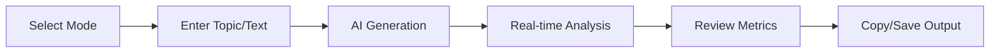

<div align="center">

# 🎓 Academic Integrity Agent

**AI-powered writing assistant that helps students create original academic content with natural human variance.**

[](https://react.dev/)
[](https://www.typescriptlang.org/)
[](https://vitejs.dev/)
[](https://supabase.com/)
[](https://ai.google.dev/)

[Features](#-features) • [Quick Start](#-quick-start) • [How It Works](#-how-it-works) • [Tech Stack](#-tech-stack) • [Ethics](#-ethical-use)

</div>

---

## ✨ Features

### 🎯 Three Specialized Writing Modes

| Mode | Purpose | Best For |
|------|---------|----------|
| **Essay & Research** | Generate original academic arguments with high semantic richness | Essays, research papers, thesis drafts |
| **Computer Science** | Technical documentation with conversational tone | Code docs, README files, tutorials |
| **Paraphrase & Humanize** | Deep syntactic restructuring of existing text | Rewording, clarity improvements |

### 📊 Real-Time Anti-Detection Metrics

- **Burstiness Analysis** — Measures sentence length variance (higher = more human-like)
- **Perplexity Estimation** — Evaluates word choice unpredictability
- **Overall Risk Score** — Combined LOW/MEDIUM/HIGH detection risk assessment
- **Sentence Distribution Chart** — Visual breakdown of short/medium/long sentences

### 🔒 Built-in Safeguards

- ✅ Ethics disclaimer on first use
- ✅ Transparent metric explanations
- ✅ User authentication via Supabase
- ✅ Generation history with cloud sync

---

## 🚀 Quick Start

### Prerequisites

- Node.js 18+ 
- npm or yarn
- [Google Gemini API Key](https://ai.google.dev/)
- [Supabase Project](https://supabase.com/) (for auth & history)

### Installation

```bash
# Clone the repository
git clone https://github.com/yourusername/academic-integrity-agent.git
cd academic-integrity-agent

# Install dependencies
npm install

# Configure environment variables
cp .env.example .env.local
```

Edit `.env.local` with your keys:

```env
VITE_GEMINI_API_KEY=your_gemini_api_key
VITE_SUPABASE_URL=your_supabase_url
VITE_SUPABASE_ANON_KEY=your_supabase_anon_key
```

### Development

```bash
npm run dev
```

Open [http://localhost:3001](http://localhost:3001) in your browser.

### Production Build

```bash
npm run build
npm run preview
```

---

## 🔄 How It Works



1. **Choose Mode** — Select Essay, CS, or Paraphrase based on your needs
2. **Input Content** — Enter your topic or paste text to paraphrase
3. **Generate** — AI creates content using mode-specific strategies
4. **Analyze** — View burstiness, perplexity, and risk scores in real-time
5. **Review** — Check warnings and adjust as needed before use

---

## 🛡️ Anti-Detection Strategies

### Burstiness Maximization
- Varies sentence lengths dramatically (short punchy → long complex)
- Avoids uniform structures common in AI text
- Creates natural rhythm variation

### Perplexity Enhancement
- Uses lower-frequency synonyms strategically
- Avoids high-probability phrase transitions
- Employs domain-specific terminology correctly

### Forbidden Phrase Avoidance
Automatically detects and warns about common AI "tells":
> ❌ "delve into" • "in conclusion" • "landscape" • "tapestry" • "crucial" • "nuanced"

---

## 🛠️ Tech Stack

| Category | Technology |
|----------|------------|
| **Frontend** | React 19, TypeScript 5, Tailwind CSS |
| **Build** | Vite 6, ESBuild |
| **AI/LLM** | Google Gemini 2.5 Flash |
| **Auth & DB** | Supabase (PostgreSQL, Row-Level Security) |
| **Icons** | Lucide React |
| **Testing** | Vitest, React Testing Library |

---

## 📁 Project Structure

```
src/
├── components/           # React UI components
│   ├── ModeSelector.tsx     # Mode selection cards
│   ├── InputPanel.tsx       # Text input & file upload
│   ├── MetricsPanel.tsx     # Anti-detection metrics display
│   ├── OutputPanel.tsx      # Generated content display
│   ├── HistoryPanel.tsx     # Generation history
│   └── LandingPage.tsx      # Marketing landing page
├── services/             # Core business logic
│   ├── academicIntegrityService.ts  # Gemini API integration
│   ├── burstinessAnalyzer.ts        # Sentence variance analysis
│   ├── perplexityEstimator.ts       # Word unpredictability
│   └── syncService.ts               # Supabase sync
├── prompts/              # Mode-specific system prompts
│   ├── modeA_essay.ts
│   ├── modeB_cs.ts
│   └── modeC_paraphrase.ts
├── contexts/             # React contexts
│   └── AuthContext.tsx      # Authentication state
├── hooks/                # Custom React hooks
│   └── useGenerationHistory.ts
└── types/                # TypeScript definitions
```

---

## ⚖️ Ethical Use

> **This tool is for educational purposes only.**

### ✅ Acceptable Uses
- Learning to write with varied sentence structure
- Brainstorming ideas for extensive modification
- Paraphrasing your own writing for clarity
- Research on AI detection techniques

### ❌ Prohibited Uses
- Submitting AI-generated content as original work
- Bypassing academic integrity requirements
- Hiding AI assistance when disclosure is required

**Always follow your institution's academic integrity policies.**

---

## 📄 License

Educational use only. Not for commercial purposes.

---

<div align="center">

Made with ❤️ for students who want to learn, not cheat.

</div>
